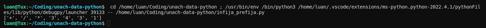

# Infija a prefija

Luis Ángel Serrano Catalá

Estructura de Datos.

LIDTS 2°P, Universidad Autónoma de Chiapas.

## Captura



## Código

```py

def ValorA(i):
    for j in range(len(Expresion1)):
        if Expresion1[j][0] == i:
            return Expresion1[j][1]


def ValorB(i):
    for j in range(len(Expresion2)):
        if Expresion2[j][0] == Pila.top():
            return Expresion2[j][1]


def vaciar():
    for k in range(Pila.size()):
        temp = Pila.desapilar()
        if temp != '(' and temp != ')':
            Prefija.append(temp)


Pila = Stack()
vA = 0
vB = 0
Prefija = ([])
Expresion1 = (['+', 1], ['-', 1], ['*', 2], ['/', 2], ['**', 4], ['(', 5])
Expresion2 = (['(', 0], ['+', 1], ['-', 1], ['/', 2],
              ['*', 2], ['**', 3], [')', 6])

Infija = ([])
Infija.extend("3*4/(3+1)")

for i in reversed(Infija):
    if i == '+' or i == '-' or i == '*' or i == '/' or i == '(' or i == ')':
        if i != ')':
            if Pila.esta_vacia():
                Pila.apilar(i)
            else:
                vA = ValorA(i)
                vB = ValorB(Pila.top())
                if vA >= vB:
                    Pila.apilar(i)
                elif vA < vB:
                    Prefija.append(Pila.desapilar())
                    Pila.apilar(i)
    else:
        Prefija.append(i)
if not Pila.esta_vacia():
    vaciar()
print(list(reversed(Prefija)))


```