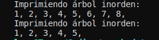

# Árboles binarios

Luis Ángel Serrano Catalá

Estructura de Datos.

LIDTS 2°P, Universidad Autónoma de Chiapas.

## Captura



## Código

```py
class Node():
    def __init__(self, data):
        self.data = data
        self.left = None
        self.right = None


class BinaryTree():
    def __init__(self, data):
        self.root = Node(data)
        pass

    def __agregar_recursivo(self, node, data):
        if data < node.data:
            if node.left is None:
                node.left = Node(data)
            else:
                self.__agregar_recursivo(node.left, data)
        else:
            if node.right is None:
                node.right = Node(data)
            else:
                self.__agregar_recursivo(node.right, data)

    def __inorden_recursivo(self, node):
        if not node:
            return

        self.__inorden_recursivo(node.left)
        print(node.data, end=", ")
        self.__inorden_recursivo(node.right)

    def __preorden_recursivo(self, node):
        if not node:
            return

        print(node.data, end=", ")
        self.__preorden_recursivo(node.left)
        self.__preorden_recursivo(node.right)

    def __postorden_recursivo(self, node):
        if not node:
            return

        self.__postorden_recursivo(node.left)
        self.__postorden_recursivo(node.right)
        print(node.data, end=", ")

    def __buscar(self, node, needle):
        if not node:
            return

        if node.data == needle:
            return node
        if needle < node.data:
            return self.__buscar(node.left, needle)
        else:
            return self.__buscar(node.right, needle)

    def __eliminar_recursivo(self, node, needle):
        if not node:
            return

        if needle < node.data:
            node.left = self.__eliminar_recursivo(node.left, needle)
        elif needle > node.data:
            node.right = self.__eliminar_recursivo(node.right, needle)
        else:
            if node.left == None:
                if not node.right:
                    temp = None
                    node = None
                    return temp

                temp = Node(node.right.data)
                temp.left = node.right.left
                temp.right = node.right.right

                node = None
                return temp
            elif node.right == None:
                if not node.left:
                    temp = None
                    node = None
                    return temp

                temp = Node(node.left.data)
                temp.left = node.left.left
                temp.right = node.left.right

                node = None
                return temp

            temp = node.copy()

            while temp and temp.left:
                temp = temp.left

            node.data = temp.data
            node.right = self.__eliminar_recursivo(node.right, needle)

    def inorden(self):
        print("Imprimiendo árbol inorden: ")
        self.__inorden_recursivo(self.root)
        print("")

    def preorden(self):
        print("Imprimiendo árbol preorden: ")
        self.__preorden_recursivo(self.root)
        print("")

    def postorden(self):
        print("Imprimiendo árbol postorden: ")
        self.__postorden_recursivo(self.root)
        print("")

    def agregar(self, data):
        self.__agregar_recursivo(self.root, data)

    def buscar(self, busqueda):
        return self.__buscar(self.root, busqueda)

    def eliminar(self, data):
        self.__eliminar_recursivo(self.root, data)


arbol = BinaryTree(5)
arbol.agregar(3)
arbol.agregar(8)
arbol.agregar(6)
arbol.agregar(4)
arbol.agregar(2)
arbol.agregar(1)
arbol.agregar(7)
arbol.inorden()
arbol.eliminar(7)
arbol.inorden()

```