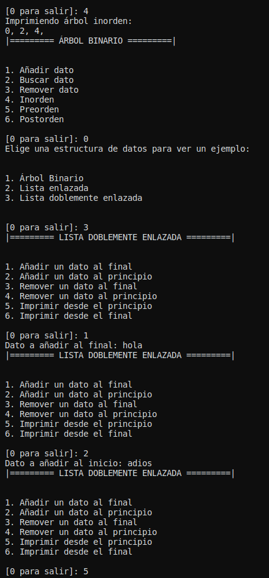

# Estructuras No Lineales

Luis Ángel Serrano Catalá

Estructura de Datos.

LIDTS 2°P, Universidad Autónoma de Chiapas.

<div class="page"/>

## Captura



<div class="page"/>

## Código

## Dependencias

### binary_tree.py

```py
class Node():
    def __init__(self, data):
        self.data = data
        self.left = None
        self.right = None


class BinaryTree():
    def __init__(self, data):
        self.root = Node(data)
        pass

    def __agregar_recursivo(self, node, data):
        if data < node.data:
            if node.left is None:
                node.left = Node(data)
            else:
                self.__agregar_recursivo(node.left, data)
        else:
            if node.right is None:
                node.right = Node(data)
            else:
                self.__agregar_recursivo(node.right, data)

    def __inorden_recursivo(self, node):
        if not node:
            return

        self.__inorden_recursivo(node.left)
        print(node.data, end=", ")
        self.__inorden_recursivo(node.right)

    def __preorden_recursivo(self, node):
        if not node:
            return

        print(node.data, end=", ")
        self.__preorden_recursivo(node.left)
        self.__preorden_recursivo(node.right)

    def __postorden_recursivo(self, node):
        if not node:
            return

        self.__postorden_recursivo(node.left)
        self.__postorden_recursivo(node.right)
        print(node.data, end=", ")

    def __buscar(self, node, needle):
        if not node:
            return

        if node.data == needle:
            return node
        if needle < node.data:
            return self.__buscar(node.left, needle)
        else:
            return self.__buscar(node.right, needle)

    def __eliminar_recursivo(self, node, needle):
        if not node:
            return

        if needle < node.data:
            node.left = self.__eliminar_recursivo(node.left, needle)
        elif needle > node.data:
            node.right = self.__eliminar_recursivo(node.right, needle)
        else:
            if node.left == None:
                if not node.right:
                    temp = None
                    node = None
                    return temp

                temp = Node(node.right.data)
                temp.left = node.right.left
                temp.right = node.right.right

                node = None
                return temp
            elif node.right == None:
                if not node.left:
                    temp = None
                    node = None
                    return temp

                temp = Node(node.left.data)
                temp.left = node.left.left
                temp.right = node.left.right

                node = None
                return temp

            temp = node.copy()

            while temp and temp.left:
                temp = temp.left

            node.data = temp.data
            node.right = self.__eliminar_recursivo(node.right, needle)

    def inorden(self):
        print("Imprimiendo árbol inorden: ")
        self.__inorden_recursivo(self.root)
        print("")

    def preorden(self):
        print("Imprimiendo árbol preorden: ")
        self.__preorden_recursivo(self.root)
        print("")

    def postorden(self):
        print("Imprimiendo árbol postorden: ")
        self.__postorden_recursivo(self.root)
        print("")

    def agregar(self, data):
        self.__agregar_recursivo(self.root, data)

    def buscar(self, busqueda):
        return self.__buscar(self.root, busqueda)

    def eliminar(self, data):
        self.__eliminar_recursivo(self.root, data)

```

### linked_list.py

```py
class Node:
    def __init__(self, data=None):
        self.data = data
        self.next = None


class LinkedList:
    def __init__(self):
        self.head = None
        pass

    def append(self, data_in):
        auxiliar_node = Node(data_in)
        auxiliar_node.next = self.head
        self.head = auxiliar_node

    def remove(self, data):
        head = self.head

        if (head is not None):
            if (head.data == data):
                self.head = head.next
                head = None
                return
        while (head is not None):
            if head.data == data:
                break
            prev = head
            head = head.next

        if (head == None):
            return

        prev.next = head.next
        head = None

    def show(self):
        printval = self.head
        while (printval):
            print(printval.data),
            printval = printval.next

```

### double_linked_list.py

```py
class Node():
    def __init__(self, data):
        self.data = data
        self.next = None
        self.prev = None
        pass


class DoubleLinkedList():
    def __init__(self):
        self.first = None
        self.last = None
        self.size = 0
        pass

    def isEmpty(self):
        return self.first == None

    def append(self, data):
        if self.isEmpty():
            self.first = self.last = Node(data)
        else:
            auxiliar_node = self.last
            self.last = auxiliar_node.next = Node(data)
            self.last.prev = auxiliar_node
        self.size += 1

    def prepend(self, data):
        if self.isEmpty():
            self.first = self.last = Node(data)
        else:
            auxiliar_node = Node(data)
            auxiliar_node.next = self.first
            self.first.prev = auxiliar_node
            self.first = auxiliar_node
        self.size += 1

    def loop(self):
        auxiliar_node = self.first
        while auxiliar_node:
            print(auxiliar_node.data)
            auxiliar_node = auxiliar_node.next

    def loop_end(self):
        auxiliar_node = self.last
        while auxiliar_node:
            print(auxiliar_node.data)
            auxiliar_node = auxiliar_node.prev

    def delete_start(self):
        if self.isEmpty():
            return
        elif self.first.next == None:
            self.first = self.last = None
            self.size = 0
        else:
            self.first = self.first.next
            self.first.prev = None
            self.size -= 1

    def delete_last(self):
        if self.isEmpty:
            return
        elif self.first.next == None:
            self.first = self.last = None
            self.size = 0
        else:
            self.last = self.last.prev
            self.last.next = None
            self.size -= 1

```

## Principal

```py
from time import sleep
from linked_list import LinkedList
from double_linked_list import DoubleLinkedList
from binary_tree import BinaryTree

option = -1
lista = LinkedList()
lista_doble = DoubleLinkedList()
arbol = BinaryTree(0)


def executeLinked():
    opt = -1
    while (opt != 0):
        print("|========= LISTA ENLAZADA =========|\n\n")
        print("1. Añadir un dato\n2.Remover un dato\n3. Imprimir lista\n")
        opt = int(input('[0 para salir]: '))

        if opt == 1:
            lista.append(input("Dato a añadir: "))
        elif opt == 2:
            lista.remove(input("Dato a eliminar: "))
        elif opt == 3:
            lista.show()
        sleep(0.5)
    pass


def executeDouble():
    opt = -1
    while (opt != 0):
        print("|========= LISTA DOBLEMENTE ENLAZADA =========|\n\n")
        print("1. Añadir un dato al final\n2. Añadir un dato al principio\n3. Remover un dato al final\n4. Remover un dato al principio\n5. Imprimir desde el principio\n6. Imprimir desde el final\n")
        opt = int(input('[0 para salir]: '))

        if opt == 1:
            lista_doble.append(input("Dato a añadir al final: "))
        elif opt == 2:
            lista_doble.prepend(input("Dato a añadir al inicio: "))
        elif opt == 3:
            lista_doble.delete_last()
        elif opt == 4:
            lista_doble.delete_start()
        elif opt == 5:
            lista_doble.loop()
        elif opt == 6:
            lista_doble.loop_end()
        sleep(0.5)
    pass


def executeTree():
    opt = -1
    while (opt != 0):
        print("|========= ÁRBOL BINARIO =========|\n\n")
        print("1. Añadir dato\n2. Buscar dato\n3. Remover dato\n4. Inorden\n5. Preorden\n6. Postorden\n")
        opt = int(input('[0 para salir]: '))

        if opt == 1:
            arbol.agregar(int(input('Dato a agregar: ')))
        elif opt == 2:
            print(arbol.buscar(int(input('Dato a buscar: '))))
        elif opt == 3:
            arbol.eliminar(int(input('Dato a eliminar: ')))
        elif opt == 4:
            arbol.inorden()
        elif opt == 5:
            arbol.preorden()
        elif opt == 6:
            arbol.postorden()
        sleep(0.5)
    pass


while (option != 0):
    print('Elige una estructura de datos para ver un ejemplo:\n\n')
    print('1. Árbol Binario\n2. Lista enlazada\n3. Lista doblemente enlazada\n\n')
    option = int(input('[0 para salir]: '))

    if option is 0:
        break
    elif option is 1:
        executeTree()
    elif option is 2:
        executeLinked()
    elif option is 3:
        executeDouble()
    else:
        print('Selecciona una opción del menú\n\n')

    sleep(0.5)

```